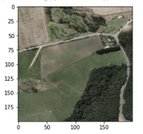

# Crash Severity

This is a 24-hours project submitted to the 2021 Geospatial Hackathon. This project aims to predict the crash severity for given road features contained within satellite images. The predictive model uses supervised learning by combining image data with crash meta data retrieved from   
https://opendata-nzta.opendata.arcgis.com/datasets/crash-analysis-system-cas-data-1
(New Zealand Transport Agency Open Data, 2020).


## Motive
The purpose of this project aims to make it easy to predict crash severity early on, which can provide impactful design decisions that need to be considered during the earlier design stage. At the same time, it can assist Civil engineers perform temporary speed alteration on existing roads during some severe conditions, or identify high severity zones that can be targeted to reduce the chances for crashes to hoccur.  

# Result
We have achived a 0.027 mean sqaure error with around 40 epochs. The training time is cut short dued to time limitation.

## Example Prediction



The severity is measured as a float from 0 to 1. A value of 1 corresponded to high severity, vice versa, a value of 0 corresponede to a low severity.
```
Light Rain
weather	brightness	speed	severity
72	LR	0.0	20	0.129950
73	LR	0.0	40	0.133711
74	LR	0.0	60	0.137473
75	LR	0.0	80	0.141234
76	LR	0.0	100	0.144996
77	LR	0.0	120	0.148758
78	LR	0.2	20	0.130481
79	LR	0.2	40	0.134242
80	LR	0.2	60	0.138004
81	LR	0.2	80	0.141766
82	LR	0.2	100	0.145527
83	LR	0.2	120	0.149289
84	LR	0.4	20	0.131012
85	LR	0.4	40	0.134774
86	LR	0.4	60	0.138535
87	LR	0.4	80	0.142297
88	LR	0.4	100	0.146058
89	LR	0.4	120	0.149820
90	LR	0.6	20	0.131543
91	LR	0.6	40	0.135305
92	LR	0.6	60	0.139066
93	LR	0.6	80	0.142828
94	LR	0.6	100	0.146589
95	LR	0.6	120	0.150351
96	LR	0.8	20	0.132074
97	LR	0.8	40	0.135836
98	LR	0.8	60	0.139597
99	LR	0.8	80	0.143359
100	LR	0.8	100	0.147121
101	LR	0.8	120	0.150882
102	LR	1.0	20	0.132605
103	LR	1.0	40	0.136367
104	LR	1.0	60	0.140129
105	LR	1.0	80	0.143890
106	LR	1.0	100	0.147652
107	LR	1.0	120	0.151413
```

```
Fine Weather
weather	brightness	speed	severity
0	F	0.0	20	0.078157
1	F	0.0	40	0.081919
2	F	0.0	60	0.085680
3	F	0.0	80	0.089442
4	F	0.0	100	0.093204
5	F	0.0	120	0.096965
6	F	0.2	20	0.078688
7	F	0.2	40	0.082450
8	F	0.2	60	0.086212
9	F	0.2	80	0.089973
10	F	0.2	100	0.093735
11	F	0.2	120	0.097496
12	F	0.4	20	0.079220
13	F	0.4	40	0.082981
14	F	0.4	60	0.086743
15	F	0.4	80	0.090504
16	F	0.4	100	0.094266
17	F	0.4	120	0.098027
18	F	0.6	20	0.079751
19	F	0.6	40	0.083512
20	F	0.6	60	0.087274
21	F	0.6	80	0.091035
22	F	0.6	100	0.094797
23	F	0.6	120	0.098559
24	F	0.8	20	0.080282
25	F	0.8	40	0.084043
26	F	0.8	60	0.087805
27	F	0.8	80	0.091567
28	F	0.8	100	0.095328
29	F	0.8	120	0.099090
30	F	1.0	20	0.080813
31	F	1.0	40	0.084575
32	F	1.0	60	0.088336
33	F	1.0	80	0.092098
34	F	1.0	100	0.095859
35	F	1.0	120	0.099621

```
The model predict that in this image, if a car crsah were to happen, the severity will be low in general. It is observed that crash with light rain will result in a higher severity. In general, speed limit is a great factor which affect severity.


```python
def test_permutations(filepath, datapoints=6):
  # Load, rescale, and reshape image input
  image = load_image(TEST_IMAGE_PATH)
  image /= 255

  # Generate all possible metadata inputs up to a certain precision
  weather = mapping.keys()
  brightness = np.linspace(0, 1, datapoints)
  speed = list(range(20, 121, 20))
  metadata = list(itertools.product(weather, brightness, speed))
  size = len(metadata)

  images = np.array([image] * size)
  inputs = np.array([np.concatenate([mapping[elem[0]], [elem[1]], [elem[2]]]) for elem in metadata])
  inputs = sc.transform(inputs)

  results = {
      'weather': list(map(lambda x: x[0], metadata)),
      'brightness': list(map(lambda x: x[1], metadata)),
      'speed': list(map(lambda x: x[2], metadata)),
      'severity': [elem[0] for elem in model.predict([images, inputs])]
  }
  return pd.DataFrame(results)
```

# Data

//data table


//the stuff that we use


# Architecture
To speed up the machine learning prcessing, image processing model `Xception` adpoted using transfer learning. 

The satellite data is paritioned into smaller piece and input into Xception. Since the crash meta data came with longitude and latitude, each crash was maped to their respective parition. The severity column from the crash data is used as result set for validation for our predictoion model.


## Xception

Xception is an extension of the inception Architecture which replaces the standard Inception modules with depthwise Separable Convolutions. 


## 
The output layer of Xception is not used in our project since it has to be concatinated with the meta data. The feature map is extracted from Xception and flattened into a 1D array before concatination with our meta data. The tensor is further put in a dense layer and a one linear neuron output layer. 


A mean square error loss funciton is adpoted because validation data is a continous value.


# Training 
During the training process, roughly 20 models are created in parallel and trained on google cloud platform. 


Due to the deadline of 24 hours, we could not train for a long time. This resulted in having to use smaller amount of epochs, 20 epochs was chosen.

we trained up to 20 different models, each trained and tested with different input parameters to attempt to achieve the highest accuracy and minimal loss.
